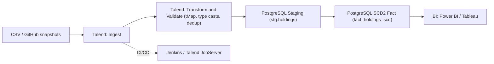
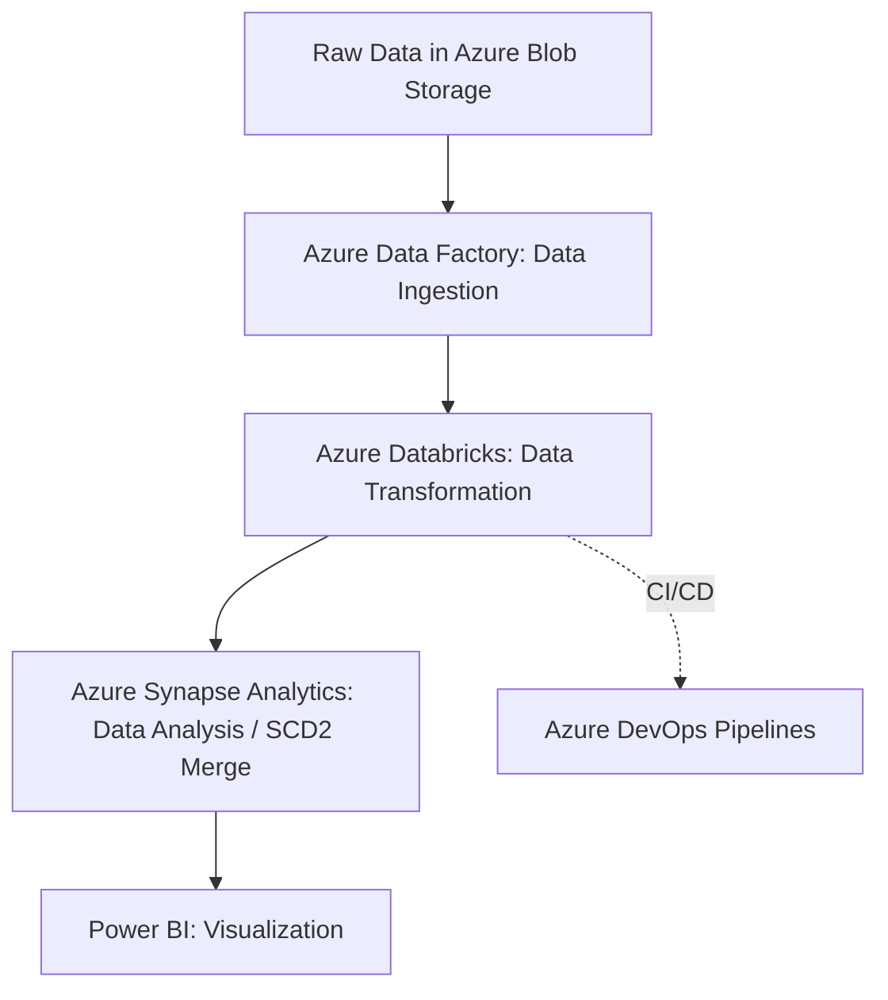

# PortFolioIQ — Financial Portfolio Management System

**What we built**  
A production-style portfolio analytics stack that tracks holdings over time with **Slowly Changing Dimension Type II (SCD2)**, computes core KPIs/risk metrics, and serves clean, BI-ready tables.

**Why we built it**  
Typical portfolio trackers only show the latest state. Audits, what-if analysis, and regulatory reporting require **history**: when did a position change, what was valid when, and how did exposures evolve? PortFolioIQ keeps a **full change log** and a clear path from raw CSVs → clean fact tables → dashboards.

**What it solves**
- Reliable **point-in-time** views of portfolios (SCD2 history).
- **Reproducible** ingestion from GitHub → data lake → warehouse.
- **Azure reference** implementation (ADF/ADLS/Databricks/Synapse) + a **local demo** (SQLite) anyone can run.
- Tested SCD logic and lightweight **risk utilities** (returns, vol, Sharpe, Sortino).

---

## Features

- SCD2 fact table for holdings (`valid_from`, `valid_to`, `is_current`).
- Azure pipelines to copy raw CSVs from GitHub to **ADLS Gen2** and/or **Synapse staging**.
- Merge logic in Synapse T-SQL and a local SCD2 equivalent in Python.
- Unit tests and CI; optional pre-commit formatting/linting.
- Clean repository layout with all CSVs under `data/`.

---
## Architecture
Phase 1 — Talend + PostgreSQL

Phase 2 — Azure

---
## Tech Stack

Azure: Data Factory, ADLS Gen2, Databricks (optional validations), Synapse Analytics (T-SQL MERGE).

Local: Python 3.10+, SQLite (demo DB).

Python: Pandas, SQLAlchemy, Typer CLI, Pydantic, (optional) PyODBC for Synapse.

DevX: GitHub Actions CI, Ruff + Black, optional pre-commit hooks.

## Data Model

Business keys: portfolio_code, symbol
Attributes: quantity, price
SCD meta: valid_from, valid_to, is_current

| portfolio\_code | symbol | quantity | price | valid\_from | valid\_to  | is\_current |
| --------------- | ------ | -------: | ----: | ----------- | ---------- | ----------- |
| P001            | AAPL   |       10 |   150 | 2024-01-01  | 2024-02-01 | 0           |
| P001            | AAPL   |       12 |   155 | 2024-02-01  | null       | 1           |

## Quickstart (Local Demo)
python -m venv .venv
source .venv/bin/activate   # Windows: .venv\Scripts\activate
pip install -r requirements.txt
pip install -e .
cp .env.example .env

# Create schema in local demo DB (SQLite)
python -m portfolioiq.db.init_db_synapse --driver sqlite

# (optional) create a small sample file
mkdir -p data/holdings/2024/02
cat > data/holdings/2024/02/holdings_2024-02-01.csv <<'CSV'
portfolio_code,symbol,quantity,price,asof
P001,AAPL,10,150,2024-01-01
P001,AAPL,12,155,2024-02-01
CSV

# Run ETL: read CSV → apply SCD2 → load fact table
python -m portfolioiq.jobs.run_etl_local --input data/holdings/2024/02/holdings_2024-02-01.csv

# Run tests and lint (use venv python to avoid global/anaconda conflicts)
python -m pytest -q
ruff check . && black --check .

## Azure Runbook (Phase 2)

- ADLS Gen2

Create a storage account with a raw filesystem (container).

Folder convention: raw/portfolioiq/holdings/<yyyy>/<MM>/....

- Data Factory

Import JSON assets from infra/:

- Linked Services: ls_http_github, ls_adls, ls_synapse_sql.

- Datasets: ds_github_holdings, ds_adls_raw_holdings, ds_synapse_stg_holdings.

- Pipelines:

copy_github_to_adls (GitHub → ADLS),

copy_github_to_synapse_staging (GitHub → Synapse staging).

- Pipeline parameters (examples):

repo_owner=architsingh9

repo_name=PortFolioIQ-Financial-Portfolio-Management-System

branch=main

file_path=data/holdings/2024/02/holdings_2024-02-01.csv

- Synapse

Run sql/schema_synapse.sql to create stg.holdings, dims, and dbo.fact_holdings_scd.

After data lands in stg.holdings, run sql/scd_type2_merge_synapse.sql.

Point BI to dbo.fact_holdings_scd (or a curated view).

- Databricks (optional)

Notebook validations on ADLS raw/staging.

Trigger SCD2 MERGE or orchestrate via ADF/DevOps.

## Talend (Phase 1 — Legacy Artifacts)

Legacy docs and exports are under docs/Talend Jobs/.

Typical flow: Talend Ingest → Transform/Validate → PostgreSQL staging → SCD2 fact → BI.

Import in Talend Studio via File → Import Items if job archives are present

## KPIs & Risk Utilities

Example KPIs in sql/kpi_queries_synapse.sql (market value, exposure).

Risk utilities in src/portfolioiq/risk_metrics.py: daily returns, annualized vol, Sharpe, Sortino.
