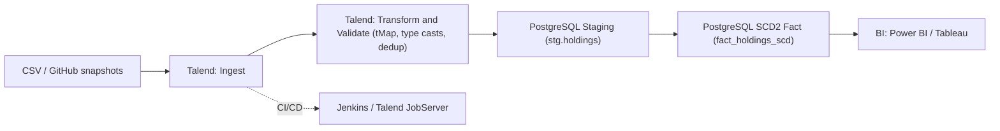
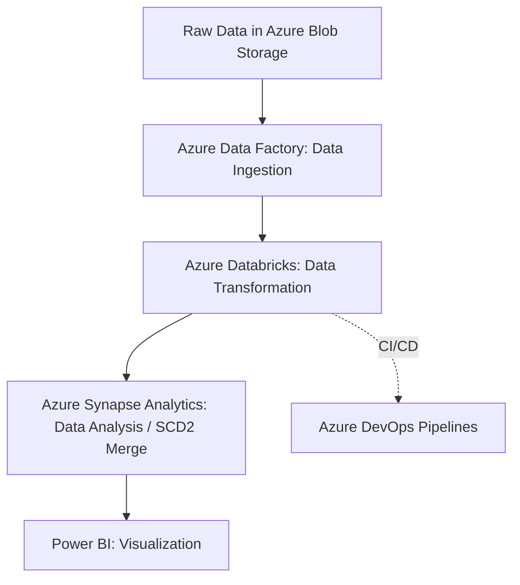

# **PortFolioIQ–Financial-Portfolio-Management-System**

## Overview

PortFolioIQ tracks portfolio holdings with SCD Type II change history, computes KPIs, and exposes BI-ready tables. It ships with:

Azure reference implementation (ADF/ADLS/Databricks/Synapse).

Local quick demo (SQLite) so anyone can run it without cloud access.

Unit tests for core SCD logic and risk utilities.

Pre-commit hooks and CI.

## Architecture
Phase 1 — Talend + PostgreSQL

Phase 2 — Azure

## Data Model

Business keys: portfolio_code, symbol
Attributes: quantity, price
SCD meta: valid_from, valid_to, is_current

| portfolio\_code | symbol | quantity | price | valid\_from | valid\_to  | is\_current |
| --------------- | ------ | -------: | ----: | ----------- | ---------- | ----------- |
| P001            | AAPL   |       10 |   150 | 2024-01-01  | 2024-02-01 | 0           |
| P001            | AAPL   |       12 |   155 | 2024-02-01  | null       | 1           |

## Quickstart (Local Demo)
python -m venv .venv
source .venv/bin/activate     # Windows: .venv\Scripts\activate
pip install -r requirements.txt
cp .env.example .env

# Create schema on local demo DB (SQLite)
python -m portfolioiq.db.init_db_synapse --driver sqlite

# Run ETL: read sample, apply SCD2, load to fact table
python -m portfolioiq.jobs.run_etl_local --input data/data_sample.csv

# Run tests and lint
pytest -q
ruff check . && black --check .

## Azure Runbook

ADLS Gen2: Create raw and processed containers.

ADF (GitHub → ADLS): Use HTTP linked service to pull from raw.githubusercontent.com to ADLS raw/holdings/<yyyy>/<MM>/<file>.csv.

ADF (ADLS → Synapse staging): Copy to stg.holdings.

Databricks: Run validations, then execute SCD2 MERGE T-SQL against Synapse.

BI: Point reports to Synapse curated tables (dbo.fact_holdings_scd)

## Ingest From GitHub With ADF

Source (public): https://raw.githubusercontent.com/<owner>/<repo>/<branch>/<path/to/file.csv>

Sink: abfss://raw@<account>.dfs.core.windows.net/holdings/<yyyy>/<MM>/<file>.csv

ADF assets are provided under infra/ in this repo.
